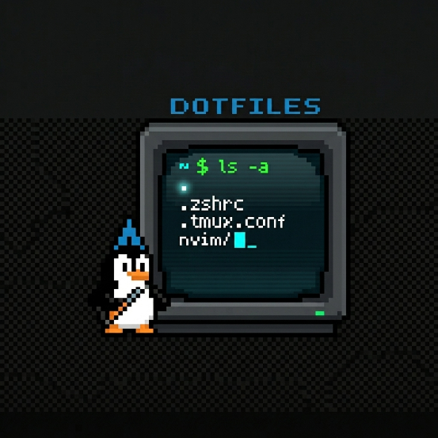

  

  <h1>Dotfiles</h1>
  
Personal configuration files for my Arch Linux setup.

## Overview

This repository contains the configuration files for the tools and applications used in my Arch Linux environment. It helps keep my setup consistent, reproducible, and easy to restore across machines.

## Why

Arch Linux offers flexibility, speed, and control, but maintaining the same environment across reinstalls or new systems can be time-consuming. Keeping dotfiles in a version-controlled repository makes backup, migration, and customization much easier.

## Contents

This repository includes configuration files for major applications and workflows used in my daily setup. The structure is kept simple so each configuration is easy to manage and update.

## Usage

Clone the repository and symlink or copy the required configuration files to their respective locations in your home directory. Review each file before applying it, since some settings may be specific to this system or workflow.

## Notes

These dotfiles are tailored to my personal preferences and may continue to evolve over time. They are primarily maintained for portability, convenience, and a cleaner setup process on Arch Linux.
